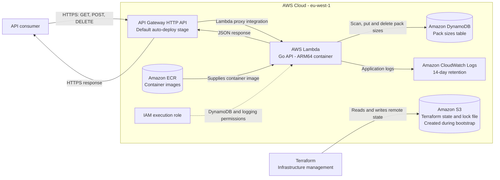

# Gymshark Coding Test

This is my attempt at the coding challenge for Gymshark. The brief summary of the problem is that a customer requests an amount of `items`, and for a given set of `packSizes`, calculate the minimum number of packs needed to ship to the customer. There were 3 key rules to satisfy:

> 1. Only whole packs can be sent. Packs cannot be broken open.
> 2. Within the constraints of Rule 1 above, send out no more items than necessary to fulfil the order. 
> 3. Within the constraints of Rules 1 &amp; 2 above, send out as few packs as possible to fulfil each order.

For more insights into my thought process for this entire project, see [THOUGHTS.md](./THOUGHTS.md).

## Prequisites

Install the following:

- To locally run the api:
  - [`go 1.25`](https://go.dev/doc/install)
  - [docker](https://docs.docker.com/engine/install/) or [docker desktop](https://docs.docker.com/desktop/setup/install/windows-install/)

- To [bootstrap the infra](#bootstrap-infra):
  - [aws cli](https://docs.aws.amazon.com/cli/latest/userguide/getting-started-install.html#getting-started-install-instructions)
  - [gh cli](https://cli.github.com/)
  - [terraform](https://developer.hashicorp.com/terraform/install)

## Quick Start

### Run locally:

To run the api locally, do the following:

```bash
cd backend
cp ".env example" .env
docker compose up -d dynamodb
go run ./cmd/seed
go run ./cmd/api
```

In a seperate terminal, you can run the following (see [API documentation](#api-structure)):

```bash
curl http://localhost:8080/health
```

To test the code:

```bash
cd backend
go test ./...
```

### Interact with deployed api:
Run the following (see [API documentation](#api-structure)):

```bash
curl https://y28lll8ovg.execute-api.eu-west-1.amazonaws.com/health
```

## Project Structure

```js
gymshark-saddiqs1
├── /.github/workflows // build & deploy CI/CD
│ 
├── backend/
│   ├── cmd/ 
│   │   ├── api // serves http api
│   │   └── seed // useful to seed initial data into db
│   ├── config/
│   ├── internal/
│   │   ├── api // configures router
│   │   ├── packsizes // manages connection & interactions with pack-sizes db
│   │   └── shippingpacks // performs calculation (see GetShippingPacksForOrder)
│   └── pkg/
│ 
└── infra/ // uses terraform to manage AWS infrastructure
```

## API Structure

| Method | Endpoint | Input | Success response | Description | Example curl requests |
| --- | --- | --- | --- | --- | --- |
| `GET` | `/health` | None | `200 OK` - `{"status":"ok"}` | Checks whether the API is running. | **Local:**<br>`curl http://localhost:8080/health`<br><br>**Deployed:**<br>`curl https://y28lll8ovg.execute-api.eu-west-1.amazonaws.com/health` |
| `GET` | `/packs-for-items-ordered` | Required query parameter: `itemsOrdered` (positive integer) | `200 OK` - an array of `{"packSize": number, "count": number}` objects | Calculates the pack sizes and quantities needed to fulfil an order. Returns `400` for an invalid or missing `itemsOrdered` value. | **Local:**<br>`curl http://localhost:8080/packs-for-items-ordered?itemsOrdered=1500`<br><br>**Deployed:**<br>`curl https://y28lll8ovg.execute-api.eu-west-1.amazonaws.com/packs-for-items-ordered?itemsOrdered=1500` |
| `GET` | `/pack-sizes` | None | `200 OK` - `{"packSizes":[250,500,1000]}` | Lists all available pack sizes. | **Local:**<br>`curl http://localhost:8080/pack-sizes`<br><br>**Deployed:**<br>`curl https://y28lll8ovg.execute-api.eu-west-1.amazonaws.com/pack-sizes` |
| `POST` | `/pack-sizes` | JSON body: `{"size":750}` where `size` is a positive integer | `201 Created` - `{"size":750}` | Adds a pack size. Returns `400` for an invalid body or `409` if the size already exists. | **Local:**<br>`curl -X POST http://localhost:8080/pack-sizes -H "Content-Type: application/json" -d '{"size":750}'`<br><br>**Deployed:**<br>`curl -X POST https://y28lll8ovg.execute-api.eu-west-1.amazonaws.com/pack-sizes -H "Content-Type: application/json" -d '{"size":750}'` |
| `DELETE` | `/pack-sizes/{size}` | Path parameter: `size` (positive integer) | `204 No Content` | Deletes a pack size. Returns `400` for an invalid size or `404` if the size does not exist. | **Local:**<br>`curl -X DELETE http://localhost:8080/pack-sizes/750`<br><br>**Deployed:**<br>`curl -X DELETE https://y28lll8ovg.execute-api.eu-west-1.amazonaws.com/pack-sizes/750` |

The API returns `500 Internal Server Error` if an endpoint cannot retrieve or update pack-size data, or cannot calculate the packs for an order.

## Infrastructure

### Architecture



### Bootstrap infra

If you wanted to deploy the infra for the first time, you will need to run `infra/bootstrap.go` - this will create any initial infrastructure needed, as well as update the current repo's GH actions secrets to ensure that the CI/CD has the necessary permissions to be able to manage the infra state. After this first time setup, GH actions will manage the infra.

To run the bootstrap:

```bash
aws login --profile gymshark-saddiqs1 --region eu-west-1
gh auth login
go run infra/bootstrap.go --aws-profile gymshark-saddiqs1
```

If you ever add new services to the infra stack, which require new permissions for the Github Roles, update `infra/bootstrap.yml` and rerun `infra/bootstrap.go`.