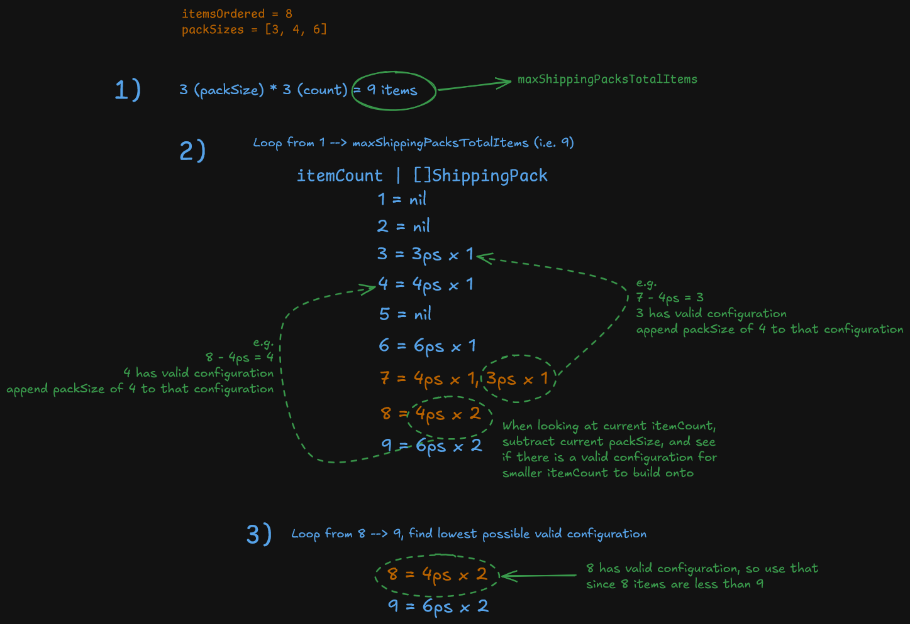

# Thoughts

I wanted to include some details related to my thought process & findings I came across whilst working on this submission. The contents are as follows:

- [`GetShippingPacksForOrder`](#getshippingpacksfororder)
  - [Attempt 1](#attempt-1)
  - [Attempt 2](#attempt-2)
- [Codebase](#codebase)
  - [`aws-lambda-web-adapter`](#aws-lambda-web-adapter)
  - [testing](#testing)
- [Improvements to be made](#improvements-to-be-made)

## `GetShippingPacksForOrder`

### Attempt 1

[Link to initial solution](https://github.com/saddiqs1/gymshark-saddiqs1/pull/1/changes#diff-79df022a1973f733218d6dc0d856909acbdf227eec9d0ac9c504610380df56b3R4)

Initially, I implemented the first solution that popped into my head. My thought process was as follows:
- Sort the `packSizes` in descending order
- Loop through each `packSize`
- If the items left to package were larger than the `packSize`, use as many packs as you can to cover off the items
- Repeatedly do this until there are no more items to cover

This seemed like an obvious solution, and worked for the most part. However I ran into some edge cases pretty quickly (with the help of the [tests](https://github.com/saddiqs1/gymshark-saddiqs1/pull/1/changes#diff-9247afe83db5e0626cabd3265179a17392b74a0cdf0ddb4ea33fff4f3e8e2ca1R42) that I setup). I tried to cover off some basic edge cases with conditional statements in the `packSizes` loop, but it was not a clean solution, and it was hardcoded around the initial list of `packSizes` provided in the exercise. 

I knew this would need revisiting, but I wanted to focus on setting up everything else in the repo first (see [Repo Structure](#repo-structure)) before coming back to it at a later time.

### Attempt 2

This time round, I had already implemented the configurable `packSizes`, so I needed to keep that in mind. I also knew that the initial logic was flawed. Take the following scenario for example:
- `itemsOrdered` = 8
- `packSizes` = [3, 4, 6]
- The expected result would be: `4x2`, however the initial logic I had before would return `6x1, 3x1`. This violates the rule 2 of the exercise (i.e. sending out too many items)

With this in mind, I approached the problem from a different point of view, and came up with the following:
- It is possible to work out the 'worse case scenario', by fulfilling the order just using the smallest `packSize` available. This can be used as a maximum amount of items (i.e. `maxShippingPacksTotalItems`) we should send out
- Inversely, we know that the 'best possible scenario' is that we send out the amount of items ordered (i.e. `itemsOrdered`). This can be used as a minimum amount of items we aim to send out
- We can loop through every number from 1 --> `maxShippingPacksTotalItems`, and calculate the best combination of packs to ship for each item count
  - Within this step, by looping from 1 --> `maxShippingPacksTotalItems`, you can leverage pre-calculated combinations to make the calculations easier
- Once we've calculated every possible combination of packs to be sent out, loop through the minimum amount of items (`itemsOrdered`) to the maximum amount of items (`maxShippingPacksTotalItems`), and the first combination we find will be the least amount of items we are able to send with a valid combination of `packSizes`.

e.g. [link to diagram](https://excalidraw.com/#json=mC5zwll_ctEn9xBmvdCts,R4wuHWDhLcr6YhfNYOM-Kg)

## Codebase

### [`aws-lambda-web-adapter`](https://github.com/aws/aws-lambda-web-adapter)
Previously when creating http api's with the intention of hosting it on lambda's, I've used the now deprecated [`aws-lambda-go-api-proxy`](https://github.com/awslabs/aws-lambda-go-api-proxy) library. This was my first time using `aws-lambda-web-adapter`, which ended up being really simple - all it required was a [one liner](https://github.com/aws/aws-lambda-web-adapter#docker-images) in the `Dockerfile`:

`COPY --from=public.ecr.aws/awsguru/aws-lambda-adapter:1.0.1 /lambda-adapter /opt/extensions/lambda-adapter`

Another cool benefit of this meant that it was easier to test & develop the code locally, since the serving of the api does not change for lambda setup specifically.

### testing

I split the tests according to the boundaries in the application:

- `shippingpacks` contains table-driven unit tests for the core packing rules and edge cases
- `api` uses an in-memory implementation of the `packsizes.Store` interface. This allows the HTTP routes, validation, response bodies, status codes, and error handling to be tested without requiring DynamoDB
- `config` verifies that application configuration is constructed correctly from environment variables
- `packsizes` has an opt-in integration test that runs the real `DynamoDBStore` against DynamoDB Local

The packing tests were especially important during development. They demonstrated that the [initial implementation](#attempt-1) worked for common inputs but failed for certain `packSize` combinations.

The API tests use a fake store because their responsibility is to verify the HTTP layer rather than DynamoDB itself. The DynamoDB integration test separately verifies the production persistence behaviour, including adding, listing and sorting sizes, conditional duplicate detection, deletion, and missing-item handling.

## Improvements to be made

- ### API Auth
  Given more time, I would protect the pack-size admin endpoints using an Amazon Cognito JWT authoriser configured on API Gateway through Terraform. Health checks and pack calculations could remain public, while adding or removing pack sizes would require an authenticated user with an administrative scope. API Gateway would validate tokens before invoking Lambda, with additional application-level authorisation where necessary.

- ### Frontend
  Unfortunately I did not get time to create a frontend, but I intended to build it using nextjs and a component library of some kind (probably [mantine](https://mantine.dev/) since I've used it for other personal projects).
